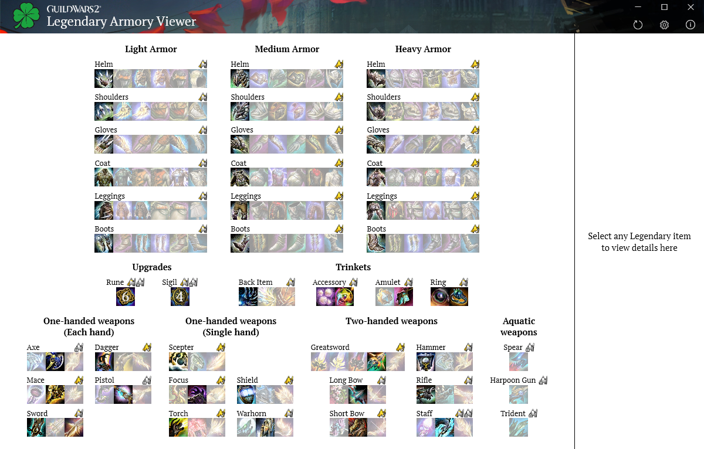

# GW2LegendaryArmoryViewer
Windows Desktop application for viewing your Guild Wars 2 legendary items usage information. The application is distributed as single .exe file, no installation needed, just download and run. To view information from your account you need to add Guild Wars 2 Api Key with proper permissions in Settings.

## Download
### [Download the latest release here](/../../releases)

## Screenshot

## Prerequisities
This application uses .NET Framework 4.8 which should be present in both Windows 10 (since v1903) and Windows 11. If for some reason you are missing the .NET Framework 4.8 Runtime Redistributable you can download it [here](https://dotnet.microsoft.com/en-us/download/dotnet-framework/thank-you/net48-web-installer).

## SmartScreen warning
SmartScreen might warn you about unknown source when launching this application for the first time. This will happen until my personal Code-Signing certificate with which I sign the final .exe gains enough reputation with SmartScreen or until I get an EV Code-Signing certificate (which is not likely).

## License
This application is licensed under MIT license.

### Graphics
© 2021 NCSOFT Corporation. All rights reserved. NCSOFT, ArenaNet, the interlocking NC logo, Guild Wars, Guild Wars 2: Heart of Thorns, Guild Wars 2: Path of Fire, and all associated logos, designs, and composite marks are trademarks or registered trademarks of NCSOFT Corporation. All other trademarks are the property of their respective owners.
